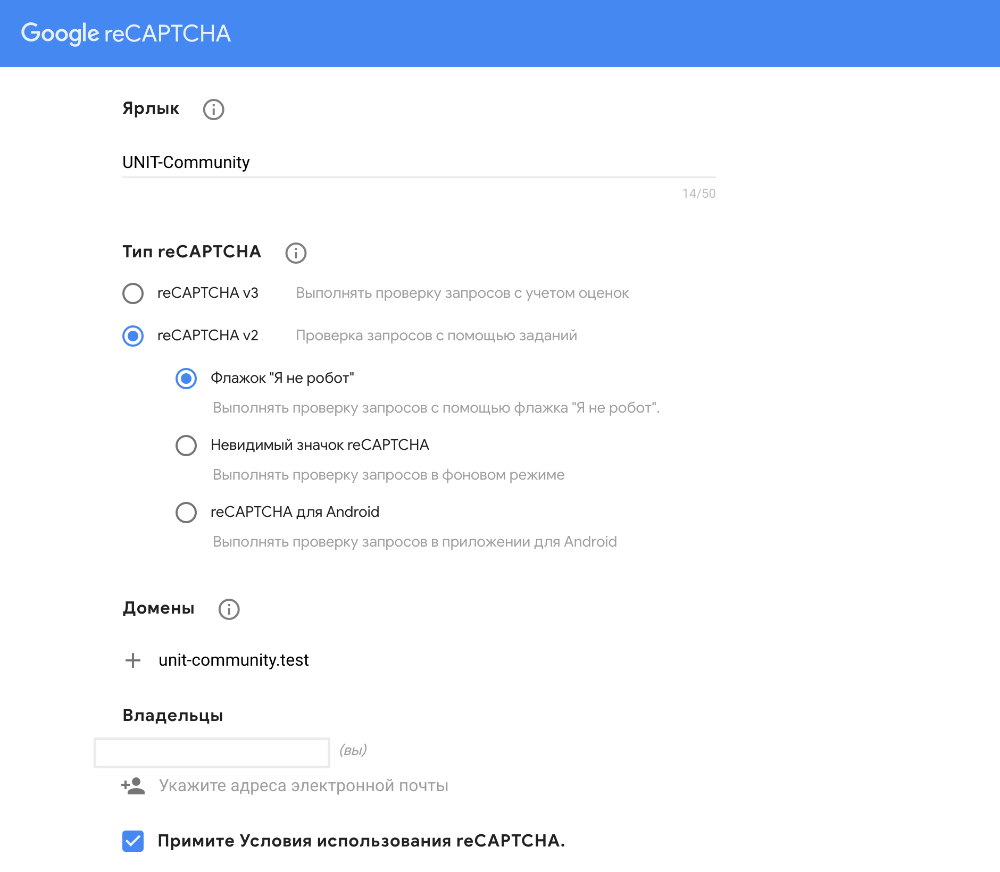

[unit-community.com](https://unit-community.com "UNIT Community") is an open source forum that was built for UNIT Factory students.

## Installation

### Step 1.

> To run this project, you must have PHP 7.3 and MySQL installed as a prerequisite.
Begin by cloning this repository to your machine, and installing all Composer dependencies.

```bash
git clone https://github.com/Navalag/unit-community.git
cd unit-community && composer install
mv .env.example .env
php artisan key:generate
```

### Step 2.

Next, create a new database and reference its name and username/password within the project's `.env` file. In the example below, we've named the database, "forum"

```
DB_CONNECTION=mysql
DB_HOST=127.0.0.1
DB_PORT=3306
DB_DATABASE=forum
DB_USERNAME=root
DB_PASSWORD=
```

### Step 3.

reCAPTCHA is a Google tool to help prevent forum spam. You'll need to create a free account (don't worry, it's quick). 

[https://www.google.com/recaptcha/intro/](https://www.google.com/recaptcha/intro/)

Choose reCAPTCHA V2, and specify your local (and eventually production) domain name, as illustrated in the image below.



Once submitted, you'll see two important keys that should be referenced in your `.env` file. 

```
RECAPTCHA_KEY=PASTE_KEY_HERE
RECAPTCHA_SECRET=PASTE_SECRET_HERE
```

### Step 4.

Until an administration portal is available, manually insert any number of "channels" (think of these as forum categories) into the "channels" table in your database.

Once finished, clear your server cache, and you're all set to go!

```
php artisan cache:clear
```

### Step 5.

Use your forum! Visit `http://unit-community.test/threads` to create a new account and publish your first thread.
